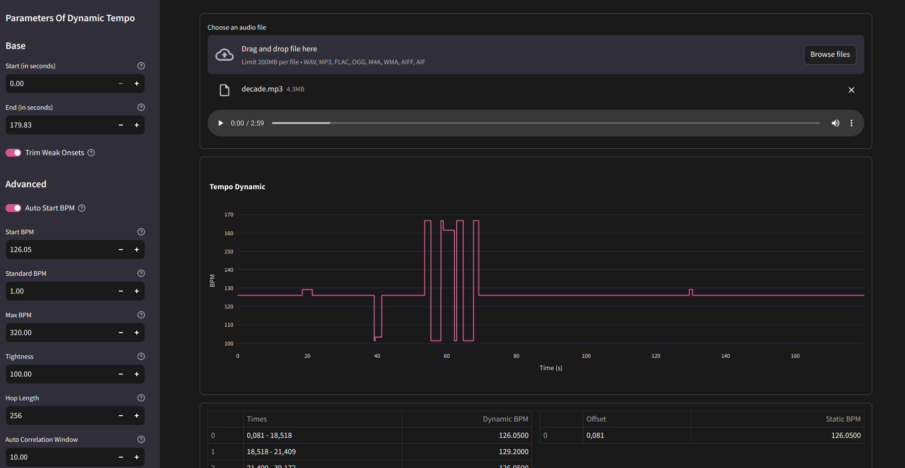

# Tanal is Tempo Analyzer for osu mappers
Tanal provides a web interface to analyze BPM
## Requirements
* git
* python 3.12, 3.11 (other versions most likely work but are not tested)
## Installation
Setup script create virtual environment and install python packages
```shell
git clone https://github.com/bitelgeuse/tanal.git
cd tanal
python setup.py
```
## Usage
```shell
python run.py
```

