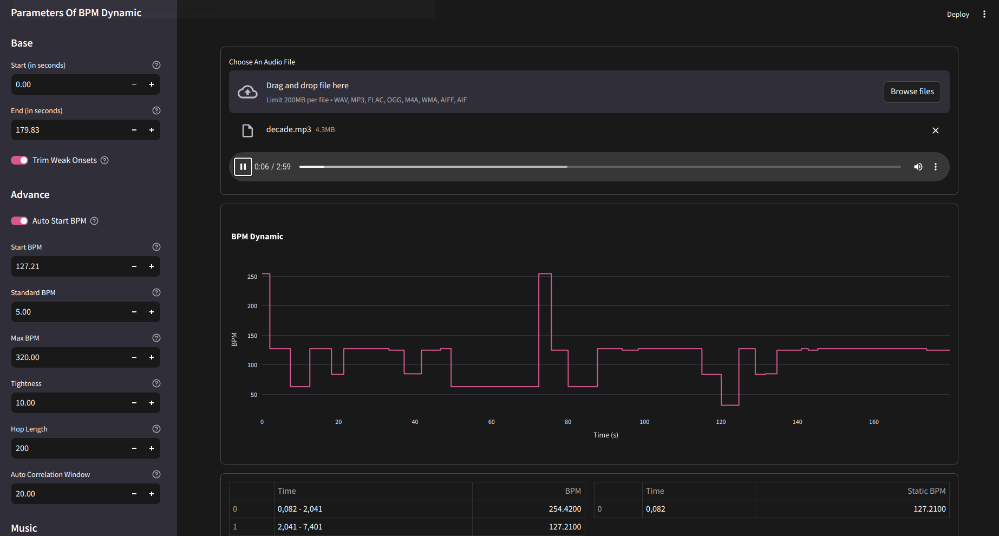

# Tanal is Tempo Analyzer for osu mappers
Tanal provides a web interface to analyze BPM in different ways
## Requirements
* python 3.12, 3.11 (other versions most likely work but are not tested)
## Installation
```shell
git clone https://github.com/bitelgeuse/tanal.git
cd tanal
python -m venv venv
# linux
./venv/bin/pip install -r requirements.txt
# windows
.\venv\Scripts\pip.exe install -r requirements.txt
```
## Usage
```shell
# linux
./venv/bin/python run.py
# windows
.\venv\Scripts\streamlit.exe run web.py
```

